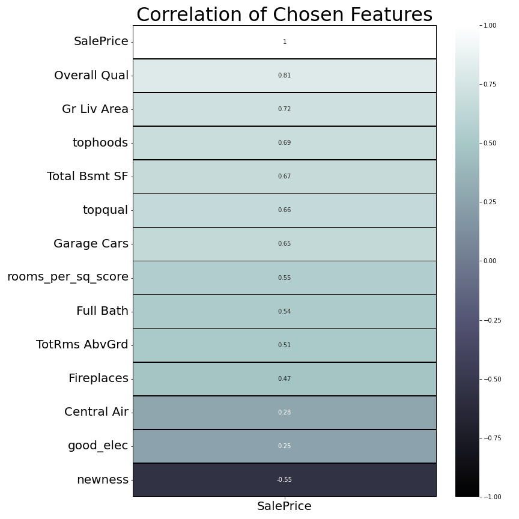
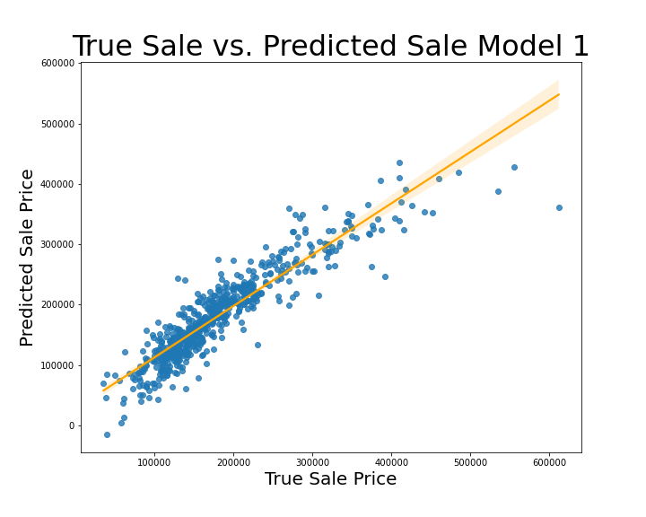
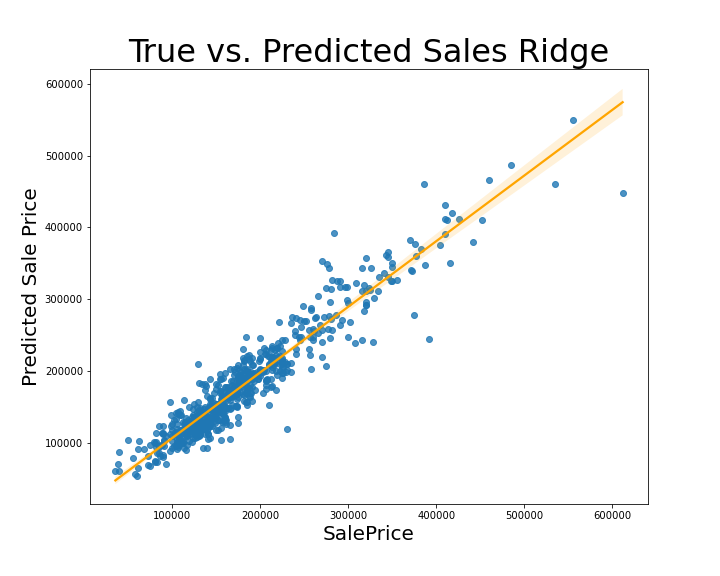

# **Ames Housing Regression Model**

## Problem Statement

Build a predictive linear regression model for real estate company to help give the local Ames, Iowa property owner, an idea of how much their home will sell for using features that are easily determinable. 

## Background

Ames, Iowa is a relatively small town of about 66k people. Around half of that population are students. Students make up such a small percentage of home owners that most studies don't seem to collect data on whether they own homes or not. According to the Urban Institute only 37% of people ages 25 - 34 own homes, so it is a safe assumption that homeowners ages 18 - 24 are even fewer. This leaves about half of Ames entire population as potential home buyers. This leaves sellers with fewer options and therefore a smaller margin for error when selling their homes, which is a complicated thing. According to Zillow, 64% of sellers lower their price at least once, which indicates they did not have an accurate expectation of what it should sell for. The longer a house is on the market, the harder it is to sell.

With that in mind it becomse critical to provide Ames with an easy to use tool that would allow for a strong understanding of how much their home will probably sell for. In the following models we aim to achieve the highest possible R2 scores while keeping the base features simple enough for the average homeowner to know.

### Data

* [`test.csv`](./datasets/test.csv): Unseen test data with no price information
* [`train.csv`](./datasets/train.csv): Raw training data to train model on
* [`train_clean.csv`](./datasets/train_clean.csv): The training data cleaned and engineered with new features
* [`kaggle_sub_1.csv`](./datasets/kaggle_sub_1.csv): Predictions for testing data in format for kaggle competition

### Folder Layout

In this repository you'll find three folders: 'code,' 'datasets,' and 'imgs.' In this current folder you'll also find the pdf for my presentation. In the 'code' folder there are two notebooks, one for cleaning, EDA, and feature engineering, and the other for modeling and some specific visualizations. In the 'datasets' folder you'll find all csv's including the original train, test, and sample submission data as well as the cleaned train data ('train_clean.csv') and the predictions for the Kaggle contest submission. Finally there is the 'imgs' folder which just contains the png's of images used here and in the presentation.

### Data Dictionary

| Feature          | Type   | Dataset         | Description                                                                                                                                                   |
|------------------|--------|-----------------|---------------------------------------------------------------------------------------------------------------------------------------------------------------|
| ID      | int | train_clean  | Unique home identifier                                                                                                          |
| SalePrice         | int  | train_clean  | Price in USD that each home sold for                                                                                                      |
| Overall Qual        | int  | train_clean  | From the 2019 Us Census, percent of senior class student body racial makeup                                                                                   |
| Total Bsmt SF              | float  | train_clean | Square footage of basement                                                            |
| Gr Liv Area            | int | train_clean        | Square footage of non-basement livable space                                                                     |
| Full Bath    | int  | train_clean        | Number of full bathrooms in home                                                                        |
| TotRms AbvGrd            | in  | train_clean        | Total number of non-basement rooms                                                             |
| Garage Cars            | float  | train_clean        | Number of cars garage can fit                                                             |
| Central Air         | int  | train_clean        | Binary column, 0 if no Central AC, 1 if there is Central AC                                                          |
| Electrical            | object  | train_clean        | Rating the home's electrical grid                                                             |
| Fireplaces        | int    | train_clean      | Number of fireplaces in home |
| Neighborhood          | object  | train_clean      | The name of the neighborhood in Ames, Iowa that home is located                                                                                                                   |
| topqual         | int  | train_clean      | Binary column of whether home is in the top 70th percentile of Overall Quality                                                                                                              |
| price_per_squareft          | float  | train_clean      | Price per square foot of home, unused in model but available if realtor has access to such information                                                                                                              |
| rooms_per_sq_score          | float  | train_clean      | Log of squarefeet over number of rooms                                                                                                                     |
| tophoods          | int  | train_clean      | Ranks 1-4 of the neighborhoods by price point, 4 being most expensive neighborhoods and 1 being the least expensive                                                                                                                     |
| good_elec         | int  | train_clean        | Binary column of whether home's electrical grid is good or not                                                                                                       |
| Heating QC_Fa | int  | train_clean | Dummy column of heat ranking Fair |
| Heating QC_Gd | int  | train_clean | Dummy column of heat ranking Good |
| Heating QC_Po | int  | train_clean | Dummy column of heat ranking Poor |
| Heating QC_TA | int  | train_clean | Dummy column of heat ranking Typical/Average |
| newness | int  | train_clean | Number reflecting the most recent construction event whether it was the house being built or a renovation. Smaller numbers are more recent|                                                                                

## Executive Summary

In this project we seek to create a predictive Linear Regression model with simple enough features for the average Ames, Iowa homeowner to utilize casually.

First we had to significantly clean the data and find the easiest features that were also correlated strongly to sale price. After sorting through around 80 features we were able to settle on the following.

As we can see all the features have at least +-0.25 correlation to SalePrice. In addition we engineered a few features including: tophoods (Neighborhoods ranked by mean price),  topqual (75th percentile of best Overall Qual homes), rooms_per_sq_score (log of sqr feet divided by rooms), good_elec (Binary of standard circuit breakers or not), newness (how recent major construction occurred, lower is better). Some of these features do show some correlation amongst themselves, however, multicollinearity is not a primary concern for this model as we are priortizing an effective price predictor regardless of the weight of each feature. With that said there was some EDA and feature selection done to minimize this.

Next we built our first Linear Regression model.

It appears pretty effective although the residuals are a little spaced out. We get: 

𝑅2 = 0.843
MAE = 21,456.02
RMSE = 31,271.81

These are not ideal so we go back to the drawing board and eventually come up with our final model.

This is a Ridge regression that is scaled using Standard Scalar after adding PolynomialFeatures. At this time due to time constraints and the relatively casual nature of the model's purpose. Having said that we ended up with pretty strong scores.

𝑅2 = 0.903
MAE = 17,190.61
RMSE = 24,612.01

Ths illustrates that we can in fact explain 90% of the variance of our model and that our predcitions are within about $17k - $24.5k. While we also ran other models including a Lasso Regression, this was found to be the most effective as it increased scores and found the sweet spot in the Bias-Variance tradeoff leaving us mostly unnoticibly underfit.

## Conclusions and Recommendations

We set out to build a Regression model that would, relatively accurately, predict the sales price of homes in Ames, Iowa. We wanted to keep the features of this model simple enough for a homeowner to quickly be able to run without having to make a lot of judgement calls, and outside research on their home.  

In this we have succeeded. We tried a few different types of models including unscaled MLR, Ridge, Lasso, with multiple iterations excluding and including Polynomial features as well as our own engineered ones. 

What we found was that our Ridge regression with PolynomialFeatures ran the best. 
It had: 

R2 = .902 or 90%
MAE = 17,190.61
RMSE = 24,612.01

This tells us that we can explain around 90% of the variance in our model with our features. We also know that according to our MAE our predictions our predictions are within 17,190 dollars or by our RMSE  of 24,612 dollars. I believe our RMSE is giving such a hefty penalty due to specific outliers left in the data, as well as the insignificant Poly features left in the model. Removing these and imputing data more elegantly should lower this score. Regardless, being able to predict a price within $25,000 of true value is sufficient for this project.

The Ames, Iowa total population is around 66,427 and 33,391 of those (almost exactly 50%) attend ISU the local university. With student home ownership being so low that data is near impossible to find (only 37% of 25 - 34 year olds own homes), one can imagine that selling a house is no easy feat in Ames and leaves little room for mistakes as the longer a house is on the market, the harder it is to sell. “In fact, according to the Zillow Group Consumer Housing Trends Report, 64 percent of sellers lower their price at least once. The key is to recognize quickly that you’ve overpriced, and make an accurate adjustment,” says Zillow. With this in mind the local average homeowner needs an easily accessible and understood resource for figuring out their home value. This model would be perfect for a local real estate company to use on their website or app that would encourage new clients to utilize their services. It could be something as easy as a questionaire that takes the input data and runs it through our Ridge Regression model. We were able to distill the needed factors from said homeowner into eleven easy questions which require little to no expert knowledge. The questions are as follows: 

|    | Questions                                                                                              |
|-----|--------------------------------------------------------------------------------------------------------|
| 1.  | How many square feet is your basement?                                                                 |
| 2.  | How many square feet is the rest of your home?                                                         |
| 3.  | How many full bathrooms do you have?                                                                   |
| 4.  | How many rooms (excluding basement) do you have?                                                       |
| 5.  | How many cars fit in your garage?                                                                      |
| 6.  | Do you have central A/C?                                                                               |
| 7.  | How many fireplaces do you have?                                                                       |
| 8.  | Do you have a standard circuit breaker?                                                                |
| 9.  | Which Ames neighborhood do you call home?                                                              |
| 10. | When was your most recent major home improvement?                                                      |
| 11. | With all previous questions in mind, how would you rank the overall quality of your home from 1 to 10? |

When continuing work on this model these are some steps that can be taken to improve performance.

1. Check outliers by category and handle appropriately.
2. Finish sorting through Poly features and drop any that have minimal impact or cause issues in model.
3. Use other modeling methods, for example Zillow uses a Neural Network, which could be quite effecitve.
4. Add Kitchen Quality, Foundation variables (note this will trade efficacy for simplicity)

## Citations

- “Ames, Iowa.” Wikipedia, Wikimedia Foundation, 15 Oct. 2021, https://en.wikipedia.org/wiki/Ames,_Iowa. 
- Choi, Jung Hyun, et al. “Millennial Homeownership.” Urban Institute, 11 Mar. 2020, https://www.urban.org/research/publication/millennial-homeownership. 
- “How to Price Your Home to Sell: Zillow.” Home Sellers Guide, 1 Nov. 2021, https://www.zillow.com/sellers-guide/how-to-price-home-to-sell/. 
